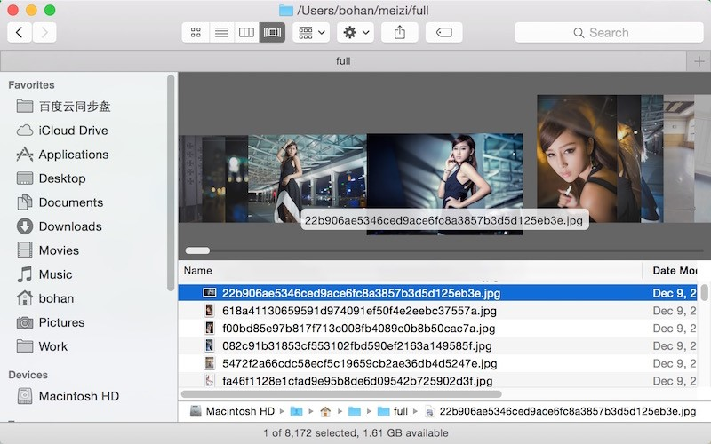

# 公开课营销

|           课程           | 时间 | 介绍 | 负责人 |
| ------------------------ | ---- | ---- | ------ |
| Python之web开发利刃      |    6月 |   已完成   | 邢文鹏 |
| Python之爬虫开发帝王     |    7月  |   已完成 | 陈恩龙 |
| Python之微信开发神器     |    7月  |    已完成   | 孔德海 |
| Python之桌面应用开发新宠 |   8月   |   已完成   | 毛兆军 |
| Python之大数据开发奇兵   |    8月  |   已完成    | 胡星辉 |
| Python之云计算开发王者   |     9月 |   已完成   |      王铭东  |
| Python之游戏开发新贵     |     9月 |   已完成   | 毛兆军  |
| Python之自运维开发明星   |     10月 | 已完成      | 罗兴波 |

## python学习ｑｑ群

公开课讲师需把此群二维码和群号放到自己的公开课课件内，在上课时去推广此群

## Python之web开发利刃(一)

### 课程简介
小伙伴听过Python吗？了解他高的离谱的工资却竞争者甚少的现况嘛？知道Python可以做web、大数据、游戏、云计算、爬虫、自动化运维等开发嘛？本次课程带你入门python web开发，体验高效的web全栈开发，引领你成为移动互联网开发的新贵

### 课程介绍

web服务器+前端=全栈开发。python语言简洁、高效、优雅，google、facebook、腾讯、豆瓣等都在使用python开发自己的产品，目前已然成为世界第五编程语言，在国内也是快速崛起，基于python的web框架清晰简明，易于快速构建企业网站，成为互联网公司的新宠。
基于web开发的三大框架，Django（全能）、Flask（轻量）、Tornado（异步高效），在就业市场招聘信息分析中企业对Django开发需求最旺盛，市场占有率最高、招聘职位最多！本系列课程带领大家入门Django开发。

Django是一个开放源代码的Web应用框架，采用了MVT的软件设计模式
使得开发复杂的、数据库驱动的网站变得简单快速。

### 课程知识点
1. web网站工作原理
2. Django的MVT模式简介
3. Model层功能实现
4. View层功能实现
5. Template层功能实现
6. Django的配置文件setting设置
7. 全栈开发，快速实现一个完整的网站

## Python之爬虫开发帝王(二)

### 课程简介

海量信息的网络如何看的更多看的更快，那就像我一样开挂吧！Fidder是一个http协议调试代理工具，可以轻松记录、截获PC、移动端(Android、Iphone、WindowPhone等)与互联网之间的Http通讯。实现手段：抓取斗鱼App数据包，分析协议、模拟手机App发出的Http请求； 

### 课程介绍

作为一个新世纪有思想、有文化、有道德、时刻准备着的屌丝男青年，在现今社会中，没事儿上上网、逛逛YY、看看斗鱼、翻翻美女图片那是必不可少的；在Python爬虫的世界里，这都不是事儿；Http抓包数据分析，模拟手机请求；斗鱼的妹子，快到碗里来。

### 课程知识点

1. 如何使用Fidder对Android、IOS等应用进行抓包
2. Http网络数据抓包与分析
3. Python爬虫框架Scrapy 
4. 异步请求、Ajax数据请求
5. 多线程图片下载

## Python之微信开发神器(三)

### 课程简介

看着人家拥有众多粉丝的微信公众号是不是各种羡慕嫉妒恨！想不想跟朋友聚会时推销自己Bigger满满的公众号？有了Python，轻轻松松开发维护属于你自己的公众号，分分钟让你变身众星捧月般的高富帅白富美！Python，你值得拥有！

### 课程介绍

微信公众号是当下推销引流的一个高效首选工具，充分利用公众号离不开微信的二次开发。Python以其简单上手、高效开发的特点而成为微信开发的首选。
本课介绍微信公众平台开发的基本流程、注意事项，并用Python实现常用接口的对接，引领同学敲开微信开发的大门！

### 课程知识点

1. 微信公众号和订阅号区别
2. 微信开发原理分析
3. 微信服务器验证
4. 微信公众号菜单
5. 公众号接收与发送消息
6. 微信jssdk包开发

## Python之桌面应用开发新宠(四)

### 课程简介

随着互联网技术的发展，我们已经步入了移动互联网时代，但是传统的工程应用软件和大型商业应用软件，还是倾向于独立的桌面应用程序的形式。在被C++和Java霸占已久桌面应用领域，几乎无所不能的Python，同样可以在桌面应用开发上大显身手！

### 课程介绍

Tkinter是Python默认的基于Tk工具包设计的GUI库， 可以提供给我们一种高效而又令人兴奋的方法来创建很多有趣又有用、而且能够运行在大多数平台下的跨平台应用。结合Tk的GUI开发的可移植性和灵活性，以及与系统语言功能集成的Python的简洁性，可以让我们快速开发和实现很多与商业软件品质相当的GUI应用，轻松愉快，就选Python！

### 课程知识点

1. 什么是GUI应用程序开发？
2. 初识Python内置GUI库——Tkinter
3. 导入模块与创建控件
4. 控件的标准属性
5. 几何管理器pack()
6. mainloop()消息循环
7. 分享你的第一个GUI应用程序吧！

## Python之大数据开发奇兵(五)
### 课程简介

大数据分布式计算框架Spark，能够进行快速，内存分布式计算，将海量数据能够快速计算结果。同时提供了大量的python开发接口，由于python的开发简单轻量化，可以直接用在产品中，越来越受到大数据初创公司欢迎。

### 课程介绍

Python的数据处理相关类库非常多，高性能的计算类库NumPy和SciPy，还有matploglib让Python画图变得更简单.本课程将对在本地机器上或者远程服务器集群上设置Spark进行简单分析，如何用Python写Spark应用，通过ADD(弹性分布式数据集)操作数据，并通过matploglib可视化显示。

### 课程知识点

1. 大数据简介
2. spark基本原理
3. PySpark配置应用
4. 数据加载到RDD5.csv读取文件内容
6. matplotlib生成分析表格
7. 案例演示

## Python之云计算开发王者(六)
### 课程简介

有时需要一台带有Linux操作系统的电脑，可是从头到尾的安装是，费时费力的事情，现在好了通过一个云计算框架，可以在几秒钟之内拥有一台崭新的电脑，而且需要的数量是看自己心情的，是不是很爽，这就是openstack

### 课程介绍

云计算近几年是非常火热的一个技术，不仅拥有令人羡慕的薪资，而且在技术方面也是处于公司的核心地位。openstack是最近几年学习python的人最值得学习的一个云计算框架。它是通过python语言开发的，因此python在编程语言方面拥有先天的优势，通过深入研究Nova和Swift模块，能够快速的搭建私有云、企业云、公有云

### 课程知识点

1. 云计算介绍
2. OpenStack概要
3. OpenStack计算设施----Nova
4. OpenStack镜像服务器----Glance
5. OpenStack存储设施----Swift
6. OpenStack认证服务----Keystone
7. OpenStack管理的Web接口----Horizon

## Python之游戏开发新贵(七)
### 课程简介

什么？Python还能做游戏？你out了吧，作为现在世界上最火热的编程语言之一，Python能做的事情要远远超过你的想象。作为一名高Bigger的Python程序员，工作闲暇之余还能写个游戏出来和朋友们一起玩耍，想想这得多有面子！

### 课程介绍

Pygame是一组用来开发游戏软件的Python程序模块，基于SDL(Simple DirectMedia Layer)库的基础上开发，专为制作电子游戏而设计，允许我们在Python程序中创建功能丰富的游戏和多媒体程序。更重要的是，Pygame具有高可移植性，可以支持多个操作系统，让我们写出的程序可以在不同平台下同时运行，轻松愉快，就选Python！

### 课程知识点

1. Welcome to PyGame
2. 创造你的第一个游戏
3. 导入模块和创建Surface对象
4. 控制精灵的运动和游戏循环的实现
5. 没有AI的游戏不是好游戏
6. 分享你的第一个Python游戏吧！

## Python之自运维开发明星(八) 

### 课程简介

pexpect，paramiko，fabric是系统批量运维管理的三大明星阵容，它们主要的功能有: 
批量执行本地或远程shell命令，批量文件上传下载及完整日志输出，安全传输登录信息等功能，
真正实现自动化运维。

### 课程介绍
IT运维人员在运维道路上被折腾的太久了: 工作繁琐、鸭梨山大、设备系统故障、熬夜加班、
IT消防员、背黑锅。这些一直以来都是运维人员之痛！而今，Python界出现了三大神器，
pexpect，paramiko，fabric，它简洁的API搭配Python简洁的语法，一键就可实现批量运维工作，
妈妈再也不用担心我的运维了。若是开发人员懂运维，钱途你懂的。

### 课程知识点

1. 传统运维管理方法
2. pexpect实现批量管理
3. paramiko实现批量管理
4. fabric实现批量管理
5. 开发人员的运维工作

