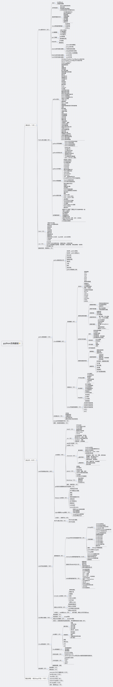
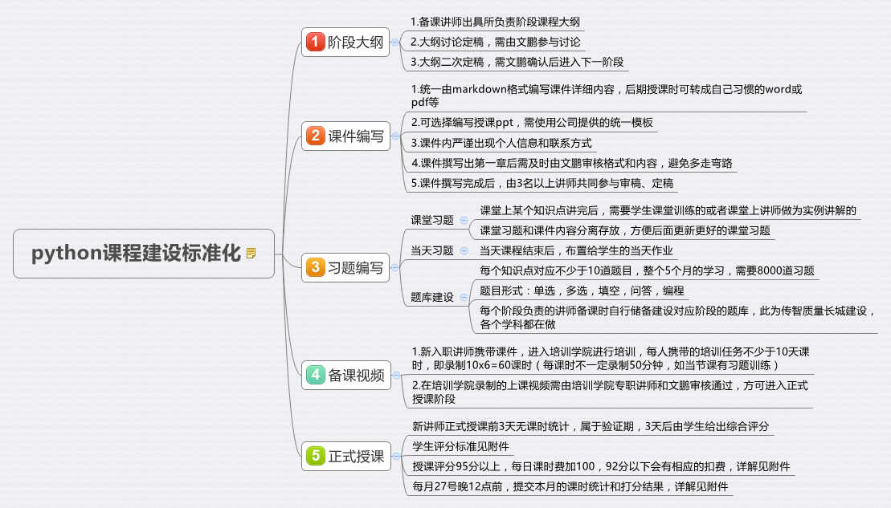
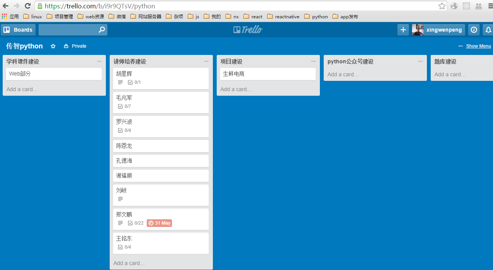
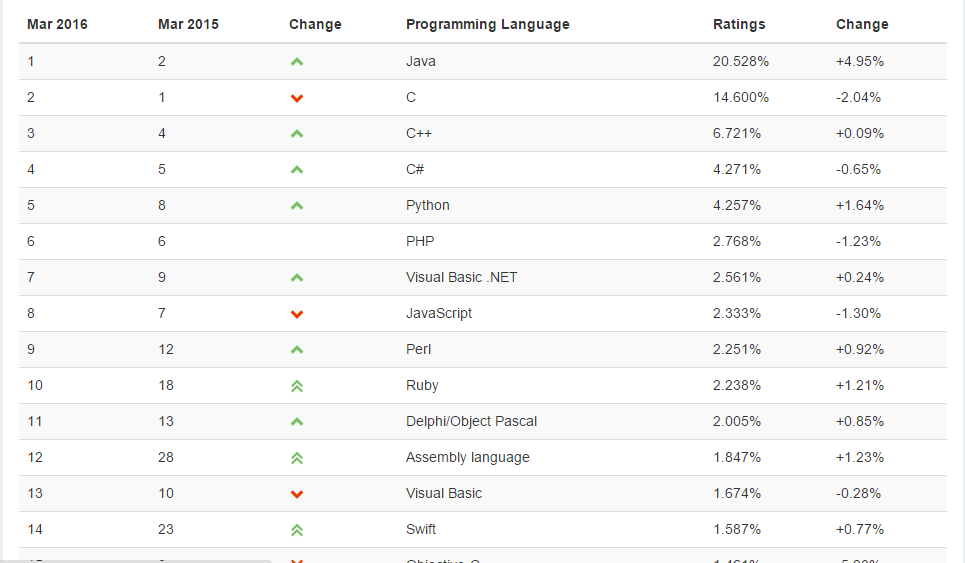

# 学科标准化建设

## python学科官网

登陆了解

	http://www.itcast.cn/subject/pythonzly/index.shtml

## 课程体系

## 新讲师备课流程

## 课件撰写模板

## 学生给讲师评分标准

## 课时统计模板

## 团队任务管理平台

	https://trello.com/b/i9r9QTsV/python

## 题库录入网站

## 讲师备课参考资源

## 咨询师培训内容

### 学习对象

1.没有任何软件编程基础和python经验，想先从0基础入手的python开发爱好者;

2.希望以较低的投入和风险来了解自己是否适合转型从事python开发的求职人员;

3.对前途迷茫、希望能丰富自己的职场技能，担心毕业即失业的小白人员;

4.可以没有任何的计算机和编程基础，但希望通过自己的付出的人打破现状的人。

### python学科常见问题

### 1.什么是python？

答：同java和php一样，也是一门编程语言，诞生于1991年，具有丰富和强大的库。它常被昵称为胶水语言，能够把用其他语
言制作的各种模块（尤其是C/C++）很轻松地联结在一起。目前开发语言排行榜排第五.

在国外很火，google的技术人员基本上都会用python，多用于开发web网站后台，搜素引擎爬虫，服务器集群自动化管理
等，因其开发速度快，语法学习简单，生产效率高，这两年在国内上升速度非常快。 

### 2.为什么要学习python语言,python的优势是什么？

答：

1.效率高! "人生苦短,我用python",
完成同一个功能，python的编码量大大少于其它编程语言，可以极大的提高程序员的开发效率，告别苦逼的加班。

2.薪资高！ 因为python生产效率高，最近两年开始在国内火起来，企业高薪招聘python工程师。

3.竞争小！市场上会python的程序员少之又少，大学教育不教python编程,开设python编程开发的培训机构也少。

4.入门易！学习python不需要有别的知识背景，python语法的简洁性，很适合新手入门。

5.风口来了！python在大数据和互联网领域，正如鱼得水般快速发展，选择比努力更重要。

### 3.传智python学科培训和竞争对手的有啥本质区别（培养方向、课程大纲）？

答： 其它机构培训方向多是偏python运维方向。

1. 入门薪资和后期成长运维岗不如开发岗成长的快。
2. 可伸缩性，开发岗转运维岗好转，运维岗转开发岗不好转
3. 运维多是学习工具使用，研发更培养逻辑思维
4. 全栈开发有机会实现创业的抱负，运维更偏向拿一份固定工资

### 4.python基础班免费吗？

答：学习费用,原价2500元python基础班，优惠价2000元

### 5.我们首期开班的话学费是有多大的优惠？学费多少？

答：原价19980，优惠价18980，首期开班立减1000，只要17980, 送基础班

### 6.python语言什么样的人最适合学？一般想做程序发开的人员，他会选择python不选择其他语言培训的主要动机是什么？
也就是说python的优势到底在哪？

答：

Python语言语法清楚，非常干净，设计优雅，具有出色的模块化特性。
它提供了面向对象能力，但不强迫用户进行面向对象设计。其类型系统提供了强大的表达能力

业界常说python适合作为大学编程入门语言，因为它简洁，易懂，实现一个功能比其他语言编写的代码更少，
很容易让学生专注于编程逻辑，而不是困惑于晦涩的语法细节上。
其实很多人在学编程的时候都是因为搞不懂语法细节，而丧失了学习兴趣。
python可以包容各种语言开发的第三方库，全局性熟悉整个项目，而不是只做项目的一个模块，一叶障目，
适合想短时间内想成为前后端全栈技术大牛，能独自撑起一个公司的有志之才。
因为你能干的事更多，所以你得到的更多。

### 7.python都说效率高，1个python工程师=2个PHP工程师=3个java工程师 这个能是否能详细解释一下？

“人生苦短，我用python”简洁，易懂，优雅，高效

效率：从程序员完成一件事情所敲的代码长度和字符个数,python比java少三分之二的代码，也比php代码少。

协作：代码简短可读性强，团队协作开发时读别人的代码速度会非常快，更接近自然语言

### 8.python语言这几年的编程语言排行趋势、使用率、市场价值分别如何？现在及未来企业对python语言的需求和潜力到底有多大？

排行趋势，使用率：
TIOBE排行榜是根据互联网上有经验的程序员、课程和第三方厂商的数量，
并使用搜索引擎（如Google、Bing、Yahoo!）以及Wikipedia、Amazon、YouTube统计出排名数据，
只是反映某个编程语言的热门程度，
并不能说明一门编程语言好不好，或者一门语言所编写的代码数量多少。
该指数可以用来检阅开发者的编程技能能否跟上趋势，或是否有必要作出战略改变，以及什么编程语言是应该及时掌握的。
观察认为，该指数反应的虽并非当前最流行或应用最广的语言，但对世界范围内开发语言的走势仍具有重要参考意义。

编程语言排行榜，python上升势头很猛，排第五。见下面链接。

	http://www.tiobe.com/tiobe_index?page=index

市场价值：从招聘企业给出的薪资体现，见以下招聘链接

	http://jobs.zhaopin.com/306517710250265.htm?ssidkey=y&ss=201&ff=03

	http://jobs.zhaopin.com/121081663251208.htm?ssidkey=y&ss=201&ff=03

	http://jobs.zhaopin.com/602273321258354.htm?ssidkey=y&ss=201&ff=03

	http://jobs.zhaopin.com/469297616250834.htm?ssidkey=y&ss=201&ff=03

### 9.如果选择做python语言开发，未来几年的职业发展路径如何（做了一年之后可以转什么，2年之后可以转什么）？

web后端工程师->后端骨干->前后端核心->技术总监	

web前端开发->前端骨干->前端核心->产品/项目经理

爬虫工程师->数据收集->大数据挖掘->大数据研究员
			

### 10.python难不难？难点在哪？

答：相比别的编程语言，python更接近自然语言，更容易被人的思维接受，语法简洁清晰，方便快速入门。难点在于灵活运用
，python有大量的第三方库可供使用，程序员不必重复造轮子，就像搭积木一样，程序员能灵活应用这些库就可以完成绝大
部分工作。

### 11.在来传智参加python培训之前，能不能给个建议可以先学习什么内容？

答：

1.安装ubuntu14.04虚拟机，熟悉Linux基本命令

2.阅读《python核心编程》

3.学习html、css、javascript基本知识

### 12.python培训的时间、学费和上课时间？

答：python分为基础班和就业班，基础班是1个月自带电脑，原价2500元，优惠价2000元；就业班是4个月，原价19980元，优惠价18980元,第一期立减1000只需17980，报就业班送基础班。

全天授课，每周上五天课；上午9点到12点，下午2点半到5点半，晚自习6点半到8点半。每周休息是采用上两天课休一天。注
意不是周末双休，目的是方便消化老师上课的内容。

### 13.就业的薪资和就业情况怎样？

答：在一线城市python毕业薪资平均是11k左右，高的到达20k，低的也有8k，我们是推荐就业、企业上门招和自己找三种方式的。在就业班后期会有就业

辅导老师的专业指导，关于面试模拟、面试技巧，都是有专业的老师指导的，只要好好学课程就业肯定是没有问题的。	

### 14.现在python市场怎么样？

答：刚刚迎来python的风口，因为其高效的开发，各大公司在考虑用python去开发新项目，或重构旧项目，去各大招聘网站搜
索python关键词，你会看到招聘python的薪资比较高，而且竞聘的人数非常少。

### 15.毕业之后的就职公司？

答：选择公司的话首先看技术，其次是学历，都可以的话可以从事比较牛的公司，像奇虎360、联想、新浪、百度、乐视、
酷我音乐、腾讯、华为、豆瓣等等，其次可以从事一些创业型公司，现在的平均薪资都在12K左右的。

### 16.python就业班学习哪些实战项目，这些项目是现有的，还是学校开发做出来的

答：项目均来自移动互联网公司真实项目。

### 17.软件工具，开发环境，数据库, 上课电脑用哪些？

答：

服务器环境：Windows电脑上安装VMware + Ubuntu14.04 +  xshell        

开发环境:Sublime Text3 + Vim + python2.7和python3.4

上课环境：以屏幕广播的模式来看到讲师的桌面, 教室有音响。

数据库：MongoDB数据库、MYSQL数据库、Redis数据库。

电脑配置：最低配置内存不低于4GB，对显卡没有要求；一般i5处理器，硬盘最好大一点，因为要保存大量视频资料。

### 18.python适合什么层次的学员学习呢？

答：python职位有初、中、高，薪资跨度8k-35k。入门简单，成长空间巨大。适合职业规划中，希望在编程领域长期走下去的
学员。

### 19.python具体是开发什么的呢？

答：web网站后台，抓取网页的爬虫程序，自动化运维，科学计算。

### 20.以后想做云计算和大数据 ，现在学习python是不是对后期有一定的帮助?

答：云计算框架openstack就是用python开发的，并且现在的大数据框架都支持python调用接口。学完python后可以去搞云计
算和大数据方向。我们的课程之所以没有加大数据，是因为企业招聘大数据一般都要非常有经验的程序员，刚培训出来的学员
不太容易竞聘大数据岗位。

### 21.python的市场需求量是不是很小?相对于其他的Java、PHP等学科来说?

答：是比java和php招聘需求少。python的市场需求量正在快速增长，很像4年前的IOS就业市场，会的人又很少，用人单位对学历和工作经验都不怎么卡，所以掌握python编程的学员,虽然职位少，但竞争更小，很容易快速高薪就业。

### 22.python基础班一个月学完有项目吗，学完能做什么？

答：有一个项目，单机网页爬虫，能自己开发出一个抓取网站页面相关信息的爬虫程序。

### 23.python和php的区别？

答：

1.是两种不同的编程语言，但都属于脚本高级语言。

2.php基本上只耕耘于web开发，python不仅可以做web开发，还可以做大数据，科学计算，量化交易，自动化运维，图形界面
开发等。

### 24.python的学习知识点很广，不知道咱们学校侧重那个方向的

答：侧重web领域全栈开发,这个领域目前市场上需求量最大，而且薪资也高。

### 25.学习python对电脑有什么要求

答：对电脑无特殊要求，希望同学们的电脑内存在4G以上，尽量Win8 64位以上操作系统，
CPU双核2.2以上，硬盘至少500G存储空间。

### 26.传智培训python，是培训Python2还是python3？

答：python现在处在从python2过渡到python3的阶段，而且这个阶段是长期的，python3是未来，所以我们会以python3为主，
兼顾讲解python2。

### 27.末位辅导是刚出的还是一直都有啊，怎么给学员介绍那?

答：一直都有；末位辅导是按照传智播客的教学体制运行的.

### 28.python学习过程中应该注意哪些问题？

答：多动手敲打代码；当天的知识点当天消化；多思考、梳理、总结、复习。

### 29.就业班的项目是讲师带着学员做么还是学员分组一起做？后期项目学员有机会练习么？

答：项目课一般流程：头几天介绍项目需求，提出项目解决方案，做需求转化；然后进行项目子系统、子模块划分；中间：讲
师带着学员做；后面：学员分组做。

### 30.python求职有没有地域性区别？会不会二三线城市不好就业？

答：python适合在一二线城市找工作，由于此语言刚在国内火的时间不长，三线城市不容易找工作，但适合去三线城市创业，

### 31.python的全栈的意思？

我们的课程中包含：客户端+服务器端+运维=全栈开发

客户端：

+ 基于html5 web客户端界面
+ 基于react native 的Android和IOS原生APP开发

服务器端：

+ 基于linux服务器集群搭建
+ 基于Django或tornado的web后台
+ 基于mysql和mongoDB的数据存储
+ 基于redis或memcached的数据缓存服务器

运维：

+ 自动化集群管理
+ 自动化分析和监控

# 咨询反馈问题

### 32.和JAVA、PHP学科对比有什么优势？

+ 语法：相比JAVA、PHP语言本身，python更简洁，易懂，优雅

+ 效率：从程序员完成一件事情所敲的代码长度和字符个数

+ 协作：代码简短可读性强，团队协作开发时读别人的代码速度会非常快，更接近自然语言

### 33.Python就业班几个项目？

共四个大项目：

+ 大项目一：电商网站平台
+ 大项目二：移动o2o应用，基于微信公众号开发
+ 大项目三：分布式爬虫
+ 大项目四：服务器集群监控和自动化运维

### 34.Python就业薪资大概多少？

+ 无工作经验应届生：8-15k
+ 有工作经验往届生：12k-25k

### 35.Python常用的工具都有哪些？

答：

+ 服务器环境：Windows电脑上安装VMware + Ubuntu14.04 +  xshell  
+ 开发环境:Sublime Text3 + Vim + python2.7和python3.4
+ 上课环境：以屏幕广播的模式来看到讲师的桌面, 教室有音响。
+ 数据库：MongoDB数据库、MYSQL数据库、Redis数据库。
+ 电脑配置：最低配置内存不低于4GB，对显卡没有要求；一般i5处理器，硬盘最好大一点，因为要保存大量视频资料。

### 36.初中学历可以学习么？学习的难度大么相比c++学科？

答：

初中学历可以学，python语言简洁易懂相对与别的语言更好入门和学习，
学习难度也相对较低。

学习难度相对于c++要简单很多。

### 37.女生适合么？
答：

非常欢迎女生学习python，因为python简单易懂，妹纸很容易入门的。
另外整个it界奇缺既懂后台服务器又懂前端的妹纸，
所以掌握python编程的女生更容易找到工作。
PS:任何一个IT团队都希望自己部门能有妹纸加入,
哪怕妹纸不写代码，写写文档，做做质量和进度管理就好。

### 38.具体的培训结束了，从事哪方面的工作呢？

答： 
从事以下几个反向工作，传智的python学科重点培养大家走web后端工程师方向。

1. web 后端工程师
2. web 前端工程师
3. web 前后端全栈工程师
4. 搜索引擎爬虫工程师
5. 数据挖掘工程师
6. 服务器集群自动化运维工程师
7. 金融领域高频量化自动交易
8. 航空航天科学计算
9. 自动化软件测试

### 39.之前很少听过这个学科，学完了好找工作么？

答：之前在c++学院实验python课程，学生学完15天的python课程后，
可以在就业市场很容易找到10000以上的工作，
所以传智重金打造师资和课程成立python学院，
专注进行python相关技术的培训，进行5个月的授课，
打造企业紧缺的python全栈人才。

学完此课程后，应届生很容易在就业市场找到12000以上的工作，有工作经验的学生很容易找到15k到20k的工作。

### 40.我看了这个学科是个刚兴起来的一个热门学科，会不会过几年就业就不
好了，毕竟国内时间还太短。

答：

python在世界范围内排名第五，可见其地位之高，而且上升势头明显，
用过java，php，c++，c#的工程师再来使用一段时间python，
用过后大多对python露出赞许之情。可见其受欢迎程度。
越来越多的公司选用python作为其开发语言，因为其简洁高效，
大大节省了人力成本。

python可以在web开发，大数据，云计算，人工智能，自动化运维等领域大展身手，这几个领域也是未来的热门发展领域，所以短期内人才缺口非常大，长期来看就业岗位也是非常多的一个学科。

### 41.既然这个学科这么好，那学习的人岂不是很多，那这样会不会学完找工作压力很大啊？

答：

竞争小！市场上会python的程序员少之又少，你可以问问你身边的人有多少懂python的。大学教育不教python编程,开设python编程开发的培训机构也少,而且多以培训运维为主,所依竞争相对别的学科小很多。

web开发、大数据和互联网快速发展，python程序员的输出，远远跟不上企业的需求。

### 42.刚兴起来的学科就业单位好找吗？会不会很少啊？

在智联上搜索python的职位

+ 搜python+8000以上,12452个职位
+ 搜django+8000以上,3691个职位

就业薪资：

在一线城市python毕业薪资平均是12k左右，高的到达25k，低的也有8k，
我们是推荐就业、企业上门招和自己找三种方式的。在就业班后期会有就
业辅导.

### 43.学完这个学科后如果就业不好转行其他学科好转吗？

答：

好转，编程思维是相通的，一门通门门通。而且我们的课程除了讲python，还讲linux系统编程，网络编程，前端javascript编程等。很容易找到相关领域的工作的。

### 44.python学科学完是做什么的呢？

### 45.目前python相对于java课程和php的课程优势 有很多， 想问下目前的市场上的需求是不是很大。就业之后找工作的话毕竟还是需要的呢。

### 46.python的主要的学习内容是什么呢？之前是在c++的课程中会讲到，他的核心知识点是什么呢？

答：

+ python核心编程
+ linux系统编程和操作
+ 数据库开发
+ web开发,web框架
+ 爬虫
+ 服务器自动化运维管理和监控

### 47.下课之后给学员发视频吗？ 

首期发基础部分视频,项目阶段视频暂时不发。

### 48.以后考虑卖视频吗？

再议

### 49.没有写基础班学啥就业班学啥 学生问的时候怎么回答呢?

见课程详解

### 50.这个学科对于英语有要求吗？ 

英语好的话，对技术成长是非常有帮助的，因为最新的it技术多发源自国外。但学习python对英语没啥要求，因为已经存在大量的中文资料了，会用有道和百度就行。

